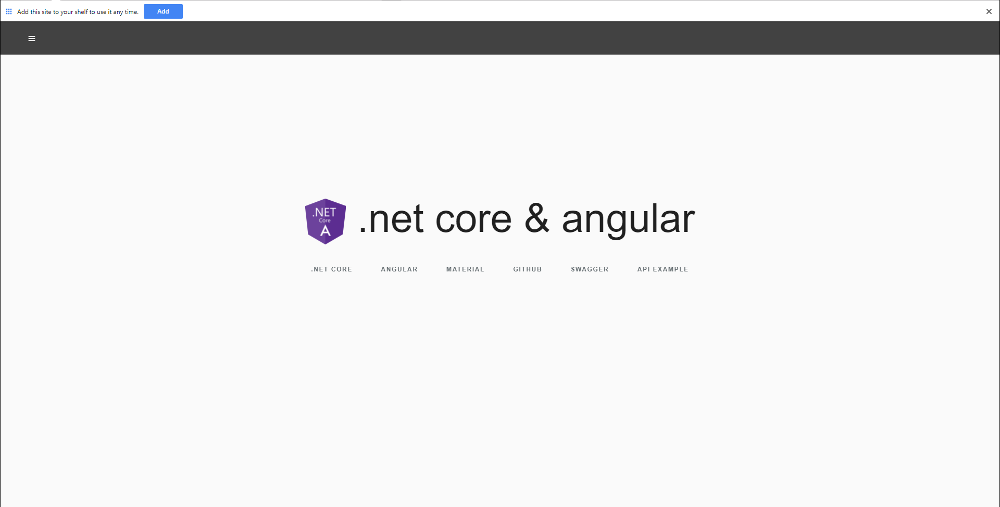
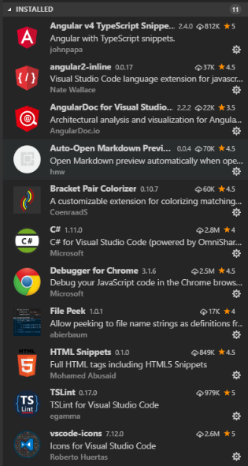

Yeoman PWA Angular 4 & .NET Core
=================

<br>
A way to quickly generate a progressive web app that uses Angular 4, .NET Core, and Entity Framework.  This application can be added to your desktop, or homescreen on iOS or Android devices. <br>
Live demo: [https://angularcore.azurewebsites.net/home](https://angularcore.azurewebsites.net/home)<br>
* The API example (Todo list) does not work in demo (no SQL server configured in Azure).


### Features
* [ASP.NET Core](http://www.dot.net/)
* [Entity Framework Core](https://docs.efproject.net/en/latest/)
* [Angular CLI & AOT](https://cli.angular.io/)
* [Angular 2 Material](https://material.angular.io/) components.
* [Webpack 2](https://webpack.github.io/)
* [Typescript 2](http://www.typescriptlang.org/)
* [SASS](http://sass-lang.com/) 
* Testing including [Jasmine](http://jasmine.github.io/) and [Karma](https://karma-runner.github.io/0.13/index.html).
* End-To-End Angular Testing using [Protractor](http://www.protractortest.org).
* [HMR](https://webpack.github.io/docs/hot-module-replacement.html) (Hot Module Replacement)
* [Serilog](https://serilog.net/) for detailed logging.
* [Swagger](http://swagger.io/) as Api explorer (Visit url **https://localhost:5001/swagger** after running the application). More [details](https://github.com/domaindrivendev/Swashbuckle.AspNetCore)
* Plus many more.

### How To Get Started


1. First, install the scaffolding tool [Yeoman](http://yeoman.io/) and the PWA Angular Core template.
```
npm install -g yo
npm install -g generator-pwa-angular-core
```
2. Install [.NET Core](http://www.dot.net/) you should be able to find documentation on getting it up and running at the provided link.
3. Install Angular CLI
```
npm install -g @angular/cli
```
4. Open the command prompt and navigate to where you want the project to be located. Then run yo and then select "Pwa Angular Core"
```
yo
```
5.  You will be prompted on to enter values for the namespace, and a prefix for your components.
6.  This will take a couple minutes for all files to be copied, packages to be installed, and for webpack to compile your resources.
 * If any errors occur during this step try running "dotnet restore" or "npm install" to find out what packages are causing issues.
7. If everything installed correctly you can now run the project by running the following command.
```
set ASPNETCORE_ENVIRONMENT=Development or setx ASPNETCORE_ENVIRONMENT "Development" (in powershell)
dotnet run
```
8. Navigate to https://localhost:5001

 <br>
9. To create your migration in your SQL server be sure the connection string in appsettings.json is correct (I use the local SQL database that comes with my Visual Studio installation).  Then run the following commands to create the tables.  The Todo API Example should now work.
```
dotnet ef migrations add InitialMigration
dotnet ef database update
```
10. You can rebuild the compiled dist folder by first cleaning out the old folders then rebuilding.
```
npm run clean:dist
npm run build:dev
```
### Deployment
I have not perfected the deployment to production but by running 
```
set ASPNETCORE_ENVIRONMENT=Production or setx ASPNETCORE_ENVIRONMENT "Production" (in powershell)
npm run clean:dist
npm run build:prod
```
This will clean your dist folder and run your use the Webpack configuration to compile production resources using AOT and different plugins to reduce project size.<br>
From here you can publish the file to an Azure App Service or whatever hosting service you decide to use.  I was not able to get the Azure command line tools working to publish the file and ended up using simple FTP to get the files deployed.

### Updates
* 1.0.4 first release.

### Development Tips
* I recommend using [Visual Studio Code](https://code.visualstudio.com/) for development.
* Here are some extensions to use inside VS Code that make your life easier.<br>
 <br>
* All the icons for iOS and Android devices can be generated using [RealFavIconGenerator](https://realfavicongenerator.net/).
* Be sure to check out the Angular CLI commands for generating components, services, and models.


### Credit
Be sure to check out the following projects. I simplified some aspects of Asadsahis .NET Core configuration and used MarkPieszaks project for inspiration.  Both are great resources on how to do certain things within Angular & .NET Core. <br>
[Progressive Web App Tutorial](https://houssein.me/progressive-angular-applications)<br>
[Asadsahi AspNetCoreSpa Template](https://github.com/asadsahi/AspNetCoreSpa) <br>
[MarkPieszak Aspnetcore Angular 2 Universal](https://github.com/MarkPieszak/aspnetcore-angular2-universal)
### Areas for Improvement
* Get lighthouse score to 100/100 currently at 82. 
* Reduce project size.
* Angular Material 2 Treeshaking

Be sure to star the repo if this was helpful.  I am planning to keep this updated and continue to improve functionality as Angular and .NET Core evolve.  Make sure you are getting the updated Yeoman generator when scaffolding the project.  You can update by running the yo command then selecting "Update your generators".